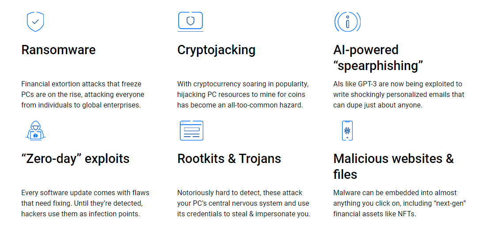
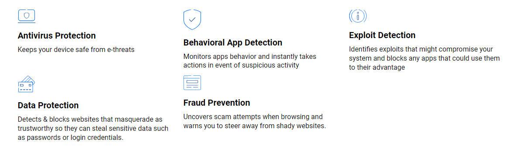

## Bitdefender

[Bitdefender]() is one of the largest names in the antivirus software industry. The company provides enterprise security packages for individual use to hundreds of users. Although Bitdefender is one of the best antivirus services in the market.

## Features of Bitdefender Antivirus

* Advanced ransomware protection.
* System optimization.
* Secure web browser for safe online payments.
* Password manager.
* VPN (virtual private network).
* Parental controls.
* Webcam and microphone protection.
* Anti-theft protection for Windows and Android.

## Bitdefender Antivirus for Windows also keeps you protected against today's ever-changing e-threats

By learning and monitoring the unique patterns of daily activity on your PC, Bitdefender Antivirus is able to quickly detect and isolate suspicious changes in real time, no matter the source.So you're protected against known and emerging threats, including:

## Bitdefender keeps your computer safe
Bitdefender Antivirus for Windows provides prevention and protection capabilities.

## Bitdefender Product Key and Its Uses

A [Bitdefender]() product key is a specific code provided when you purchase a Bitdefender antivirus or security product. It's used during installation to verify the legitimacy of the software. This key unlocks the full features of the software and ensures you're using a licensed version. Safeguard your product key as it's vital for maintaining software security and functionality.

## How to Download and Install Bitdefender Antivirus?

**Here are the steps to download and install Bitdefender Antivirus:**

1. Visit the official [Bitdefender]() website.
2. Choose the appropriate product version (free or paid) that fits your needs.
3. Select the subscription plan if you're opting for a paid version.
4. Add the product to your cart and complete the purchase by providing necessary information.
5. Download the installer from the provided link.
6. Run the downloaded installer.
7. Follow on-screen instructions for the installation process.

   
## How to Activate Bitdefender Antivirus

1. Launch the antivirus after installing.
2. Access "Activate" section.
3. Enter product key.
4. Connect to the Internet.
5. Software verifies key and activates.
6. Receive activation confirmation.
7. Update for latest definitions.
8. Run initial system scan.
9. Customize settings.
